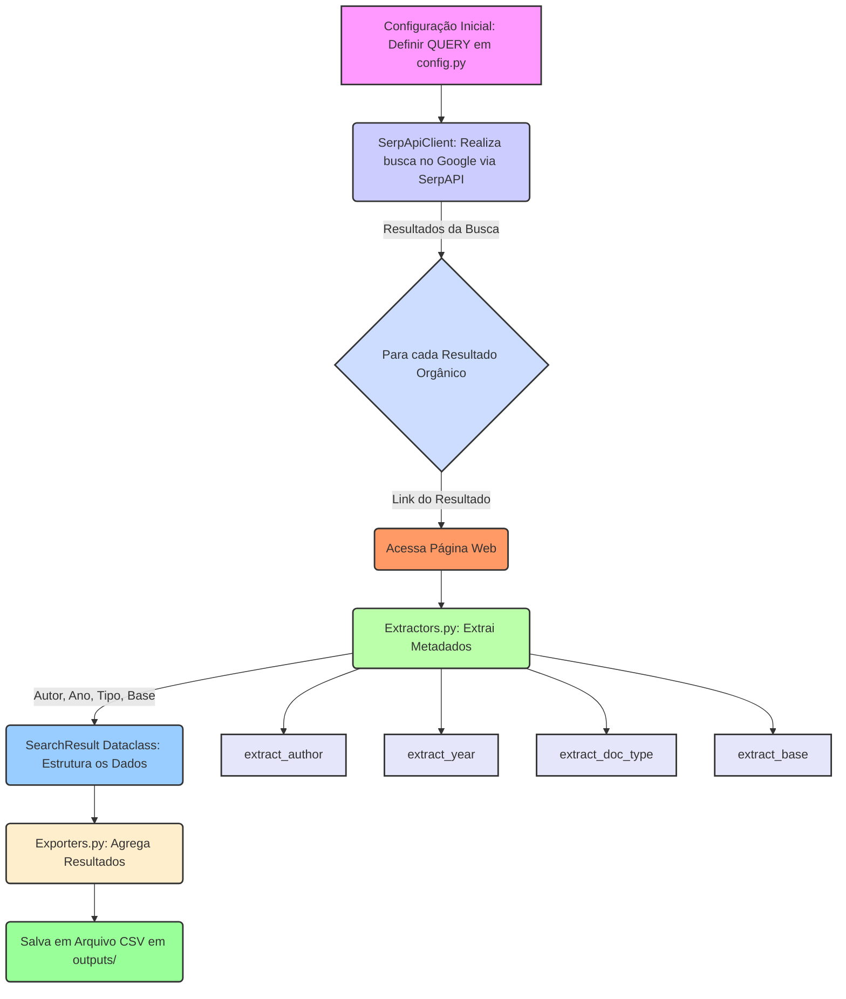

# SoftScrape

SoftScrape é uma ferramenta em Python para realizar buscas no Google (via SerpAPI), extrair metadados de páginas web (autor, ano, tipo de documento, base) e gerar relatórios em CSV.

## 📦 Visão Geral

- Executa buscas paginadas no Google usando [`SerpApiClient`](src/softscrape/clients/serpapi_client.py).
- Para cada resultado orgânico, faz download da página e extrai:
  - Autor: [`extract_author`](src/softscrape/extractors.py)
  - Ano:   [`extract_year`](src/softscrape/extractors.py)
  - Tipo:  [`extract_doc_type`](src/softscrape/extractors.py)
  - Base:  [`extract_base`](src/softscrape/extractors.py)
- Agrega tudo em dataclass [`SearchResult`](src/softscrape/models.py)
- Exporta para CSV com [`to_csv`](src/softscrape/exporters.py) em `outputs/`

## 🚀 Funcionalidades

- Paginação customizável (`settings.PAGES`)
- Pausa entre requisições (`settings.PAUSE_SEC`)
- Retry & log de erros/warnings ([`logger.py`](src/softscrape/logger.py))
- CSV timestamped em `src/softscrape/outputs/`

## 🛠️ Pré-requisitos

- Python 3.8+
- Virtualenv (opcional, mas recomendado)
- Conta no SerpAPI com API Key

## 📥 Instalação

1. Clone este repositório
2. Crie e ative um virtualenv:

   ```bash
   python -m venv .venv
   source .venv/bin/activate   # Linux/Mac
   .venv\Scripts\activate      # Windows
   ```
3. Instale dependências:

   ```bash
   pip install -r requirements.txt
   ```

## 🔧 Configuração
1. Cadastre-se em SerpAPI:
   https://serpapi.com/users/sign_up
2. Após o cadastro, copie sua API Key do painel SerpAPI.
3. Crie um arquivo .env na raiz do projeto com:
   ```bash
   SERPAPI_API_KEY=your_api_key_aqui
   ```
4. (Opcional) Ajuste em src/softscrape/config.py:
- QUERY (termos de busca)
- PAGES (número de páginas)
- PAUSE_SEC (delay entre requisições)

▶️ Como rodar
   ```bash
   # estando na raiz do projeto
   python3 main.py
   ```
Você verá progresso no terminal (páginas e resultados) e, no final, receberá log de onde o CSV foi salvo, exemplo:
   ```bash
   INFO – CSV salvo em 'src/softscrape/outputs/resultados_pesquisa_20240601_103015.csv'
   ```

📂 Estrutura do projeto
   ```bash
      .
   ├── .env
   ├── .gitignore
   ├── README.md
   ├── requirements.txt
   ├── src/softscrape
   │   ├── clients
   │   │   └── serpapi_client.py
   │   ├── extractors.py
   │   ├── exporters.py
   │   ├── logger.py
   │   ├── main.py
   │   ├── models.py
   │   └── config.py
   └── outputs/
      └── resultados_pesquisa*.csv
   ```

📊 Saída
Os arquivos CSV gerados ficam em src/softscrape/outputs/ (ignorado pelo Git). Cada linha segue o modelo SearchResult.

## 🖼️ Big Picture (Diagrama)

