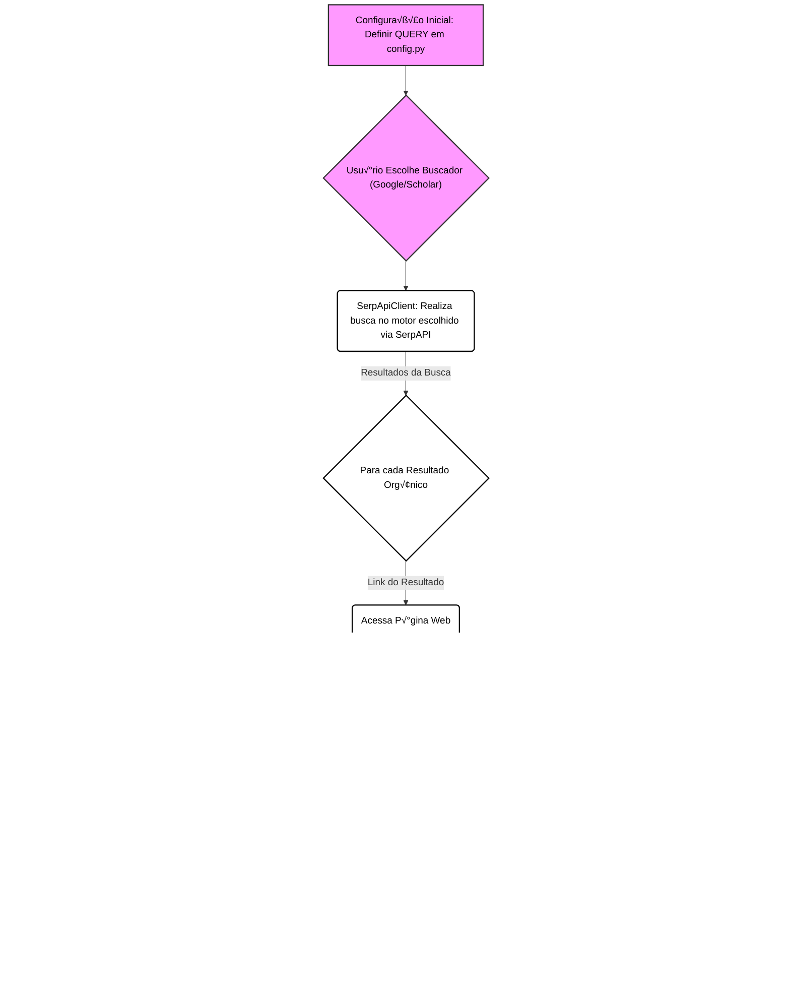
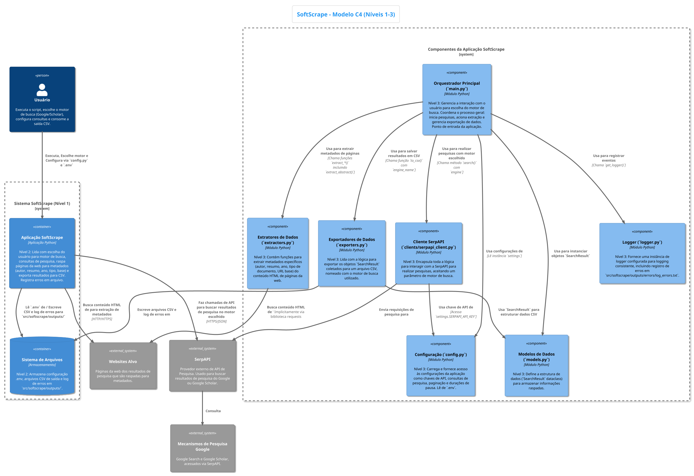

# SoftScrape

SoftScrape é uma ferramenta em Python para realizar buscas no Google e Google Scholar (via SerpAPI), extrair metadados de páginas web (autor, resumo, ano, tipo de documento, base) e gerar relatórios em CSV.

## 📦 Visão Geral

- Permite ao usu√°rio escolher entre Google Search e Google Scholar para as buscas.
- Executa buscas paginadas usando [`SerpApiClient`](src/softscrape/clients/serpapi_client.py).
- Para cada resultado org√¢nico, faz download da p√°gina e extrai:
  - Autor: [`extract_author`](src/softscrape/extractors.py)
  - Resumo: [`extract_abstract`](src/softscrape/extractors.py) (com fallback para o snippet da API)
  - Ano:   [`extract_year`](src/softscrape/extractors.py)
  - Tipo:  [`extract_doc_type`](src/softscrape/extractors.py)
  - Base:  [`extract_base`](src/softscrape/extractors.py)
- Agrega tudo em dataclass [`SearchResult`](src/softscrape/models.py)
- Exporta para CSV com [`to_csv`](src/softscrape/exporters.py) em `src/softscrape/outputs/`, com nome do arquivo incluindo o buscador utilizado.
- Registra erros em um arquivo dedicado: `src/softscrape/outputs/errors/log_errors.txt`.

## üöÄ Funcionalidades

- Escolha interativa do motor de busca (Google ou Google Scholar).
- Paginação customizável (`settings.PAGES`)
- Pausa entre requisições (`settings.PAUSE_SEC`)
- Retry & log de erros/warnings ([`logger.py`](src/softscrape/logger.py)), com erros críticos salvos em arquivo.
- CSV timestamped e nomeado com o buscador em `src/softscrape/outputs/`
- Extração aprimorada de autores e resumos.

## 🛠️ Pré-requisitos

- Python 3.8+
- Virtualenv (opcional, mas recomendado)
- Conta no SerpAPI com API Key

## 📥 Instalação

1. Clone este repositório
2. Crie e ative um virtualenv:

   ```bash
   python -m venv .venv
   source .venv/bin/activate   # Linux/Mac
   .venv\Scripts\activate      # Windows
   ```
3. Instale dependências:

   ```bash
   pip install -r requirements.txt
   ```

## 🔧 Configuração
1. Cadastre-se em SerpAPI:
   https://serpapi.com/users/sign_up
2. Após o cadastro, copie sua API Key do painel SerpAPI.
3. Crie um arquivo .env na raiz do projeto com:
   ```bash
   SERPAPI_API_KEY=your_api_key_aqui
   ```
4. (Opcional) Ajuste em src/softscrape/config.py:
- QUERY (termos de busca)
- PAGES (n√∫mero de p√°ginas)
- PAUSE_SEC (delay entre requisições)

▶️ Como rodar
   ```bash
   # estando na raiz do projeto
   python3 src/softscrape/main.py
   ```
O script irá perguntar qual buscador você deseja usar:
   ```
   Qual buscador você gostaria de usar? (google / scholar): scholar
   ```
Você verá progresso no terminal (páginas e resultados) e, no final, receberá log de onde o CSV foi salvo, exemplo:
   ```bash
   INFO – CSV salvo em \'src/softscrape/outputs/resultados_pesquisa_google_scholar_20250522_212537.csv\'
   INFO - Erros (se houver) foram registrados em \'src/softscrape/outputs/errors/log_errors.txt\'
   ```

## ‚úÖ Testes Automatizados

O projeto utiliza `pytest` para testes unitários e `pytest-cov` para medição de cobertura de código.

### Como rodar os testes

1.  Certifique-se de que as dependências de desenvolvimento estão instaladas (incluindo `pytest` e `pytest-cov`, que estão no `requirements.txt`).
2.  Na raiz do projeto, execute:

    ```bash
    pytest
    ```

### Gerando Relatório de Cobertura

Para gerar um relatório de cobertura e visualizá-lo em HTML:

1.  Execute o seguinte comando na raiz do projeto:

    ```bash
    pytest --cov=src --cov-report=html
    ```
2.  Abra o arquivo `htmlcov/index.html` no seu navegador para ver o relatório detalhado.

Os testes cobrem os principais componentes do `src/softscrape/`, incluindo:
- `config.py`
- `exporters.py`
- `extractors.py`
- `logger.py`
- `models.py`

📂 Estrutura do projeto
   ```bash
      .
   ├── .env
   ├── .gitignore
   ├── README.md
   ├── requirements.txt
   ├── src/softscrape
   │   ├── clients
   │   │   └── serpapi_client.py
   │   ├── extractors.py
   │   ├── exporters.py
   │   ├── logger.py
   │   ├── main.py
   │   ├── models.py
   │   ├── config.py
   │   └── outputs/
   │       ├── resultados_pesquisa_*.csv
   │       └── errors/
   │           └── log_errors.txt
   └── outputs/  # Pode ser usado para outros artefatos, mas os CSVs do script vão para src/softscrape/outputs
      └── ...
   ```

📊 Saída
Os arquivos CSV gerados ficam em `src/softscrape/outputs/` (ignorado pelo Git). O nome do arquivo inclui o buscador escolhido e um timestamp (ex: `resultados_pesquisa_google_scholar_YYYYMMDD_HHMMSS.csv`). Cada linha segue o modelo `SearchResult`.
Os erros de execução são registrados em `src/softscrape/outputs/errors/log_errors.txt`.

## 🖼️ Big Picture (Diagrama)


```mermaid
graph TD
    A["Configuração Inicial: Definir QUERY em config.py"] --> A1{"Usuário Escolhe Buscador (Google/Scholar)"};
    A1 --> B("SerpApiClient: Realiza busca no motor escolhido via SerpAPI");
    B -- "Resultados da Busca" --> C{"Para cada Resultado Org√¢nico"};
C -- "Link do Resultado" --> D("Acessa P√°gina Web");
    D --> E("Extractors.py: Extrai Metadados");
    E -- "Autor, Resumo, Ano, Tipo, Base" --> F("SearchResult Dataclass: Estrutura os Dados");
    F --> G("Exporters.py: Agrega Resultados");
    G --> H("Salva em Arquivo CSV em outputs/ (nomeado com buscador)");
    Z["Logger.py: Registra erros em outputs/errors/log_errors.txt"];

    E --> E1["extract_author"];
    E --> E2["extract_year"];
    E --> E3["extract_doc_type"];
    E --> E4["extract_base"];
    E --> E5["extract_abstract"];

    style A fill:#f9f,stroke:#333,stroke-width:2px,color:#000;
    style A1 fill:#f9f,stroke:#333,stroke-width:2px,color:#000;
    style B fill:#fff,stroke:#000,stroke-width:2px,color:#000;
    style C fill:#fff,stroke:#000,stroke-width:2px,color:#000;
    style D fill:#fff,stroke:#000,stroke-width:2px,color:#000;
    style E fill:#fff,stroke:#000,stroke-width:2px,color:#000;
    style F fill:#fff,stroke:#000,stroke-width:2px,color:#000;
    style G fill:#fff,stroke:#000,stroke-width:2px,color:#000;
    style H fill:#9f9,stroke:#333,stroke-width:2px,color:#000;
    style Z fill:#ffcc00,stroke:#333,stroke-width:2px,color:#000;
    style E1 fill:#eee,stroke:#000,stroke-width:2px,color:#000;
    style E2 fill:#eee,stroke:#000,stroke-width:2px,color:#000;
    style E3 fill:#eee,stroke:#000,stroke-width:2px,color:#000;
    style E4 fill:#eee,stroke:#000,stroke-width:2px,color:#000;
    style E5 fill:#eee,stroke:#000,stroke-width:2px,color:#000;
```

## 🏛️ Modelo C4

Abaixo estão os diagramas C4 que ilustram a arquitetura do SoftScrape em diferentes níveis de detalhe.

### Nível 1-3: Contexto Geral do Sistema



### Nível 4: Detalhes de Componentes Específicos

Os seguintes diagramas detalham componentes específicos do sistema:

- **Clients (SerpAPI):**
  
- **Config:**
  
- **Exporters:**
  
- **Extractors:**
  
- **Logger:**
  
- **Main:**
  
- **Models:**
  
